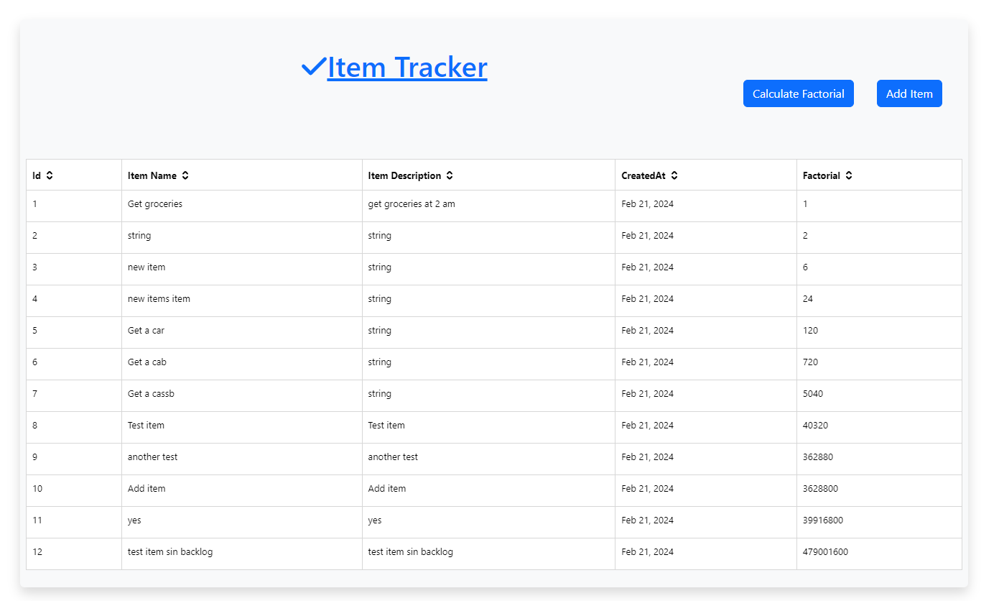
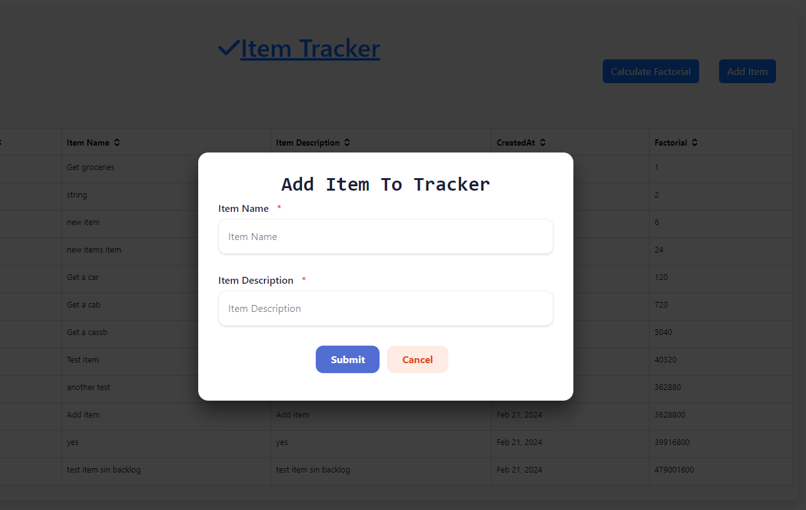
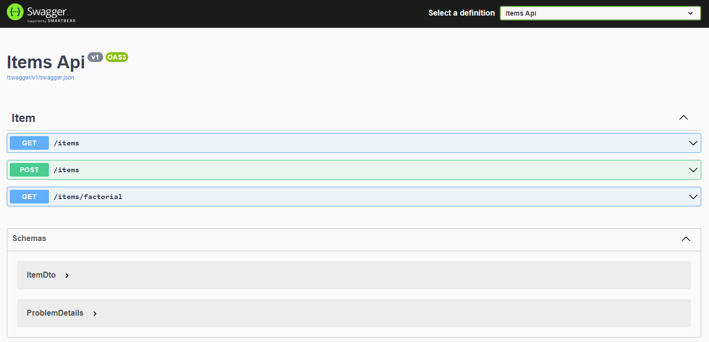

# Complytek Angular & .NET Assesment

- __Add items__

- __List Items__

- __Calculate factorial__

# Get Code

Clone the project

```bash
  git clone https://github.com/Njuguna-JohnBrian/complytek-assesment.git
```

## **Frontent & Backend**

# [Frontend Application]()
- Screenshots

  `.` Home Screen List Items


  


    `.` Home Screen Add Item


  

  # Run Frontend

## Navigate to the project directory

```bash
  cd frontend
```

## Install Dependencies and Start

- __Install Dependencies__

```bash
  npm install
```

- __Run Project To View In Browser__

```bash
  ng serve -o
```

- __Run Tests__

```bash
  ng test
```

# [Backend Application]()

- Screenshots

  `.` Backend Docs


  


# Run Backend

## Navigate to the project directory

```bash
  cd backend
```

## Build project and Start

- __Build Api__

```bash
  dotnet build --project backend.api/
```

- __Build Api Unit Tests__

```bash
  dotnet build --project backend.tests/
```

- __Start Api__

```bash
  dotnet run --project backend.api/
```

## API Reference


### Root route

```http
    /items
```

#### Add Item

```http
  POST
```

| Parameter | Type     | Description                |
| :-------- | :------- | :------------------------- |
| `ItemName` | `string` | **Required** |
| `ItemDescription` | `string` | **Required** |

#### Get Items

```http
  GET
```

| Result | Type     | Description                       |
| :-------- | :------- | :-------------------------------- |
| `Id`      | `number` | |
| `ItemId` | `string` ||
| `ItemName` | `string` ||
| `ItemDescription` | `string` ||
| `CreatedDtm` | `string` ||


#### Get Factorials

```http
  GET /factorial
```

| Result | Type     | Description                       |
| :-------- | :------- | :-------------------------------- |
| `ItemId` | `number` ||
| `factorial` | `string` ||


## Authors

- [@Njuguna John Brian Ngugi](https://github.com/Njuguna-JohnBrian)

